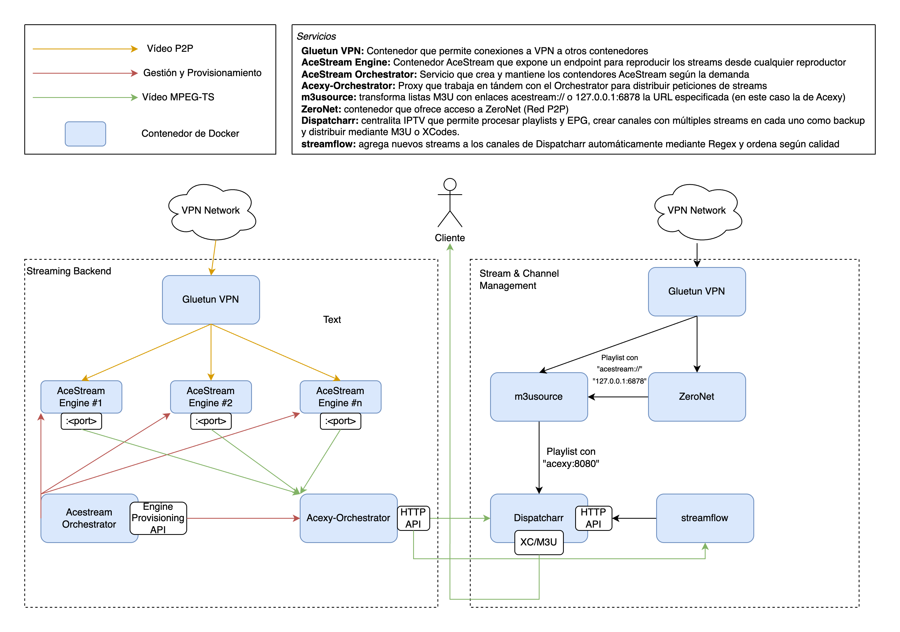

# Developer Platform

<h2 align="center">AceStack</h2>

Mi stack de IPTV con backend AceStream para una experiencia sin (muchos) problemas

<table data-view="cards"><thead><tr><th></th><th></th><th></th><th data-hidden data-card-target data-type="content-ref"></th><th data-hidden data-card-cover data-type="files"></th></tr></thead><tbody><tr><td><h4><i class="fa-terminal">:terminal:</i></h4></td><td><strong>Guía Rápida</strong></td><td>Guía Rápida para el Despliegue del Stack</td><td><a href="https://app.gitbook.com/o/8vLYKpMznNuwJAHNprDT/s/ZhjUJ0Hr3Rs1H4b7Icz0/">API Reference</a></td><td><a href=".gitbook/assets/logo-guide-logos-1.svg">logo-guide-logos-1.svg</a></td></tr><tr><td><h4><i class="fa-engine">:engine:</i></h4></td><td><strong>Backend AceStream</strong></td><td>Explicación y Despliegue del backend para reproducir videos P2P</td><td><a href="https://app.gitbook.com/o/8vLYKpMznNuwJAHNprDT/s/UrMpAypuWXojqm3QNLDt/">Documentation</a></td><td><a href=".gitbook/assets/md_home_logo.png">md_home_logo.png</a></td></tr><tr><td><h4><i class="fa-server">:server:</i></h4></td><td>Distribución con Dispatcharr</td><td>Explicación y Despliegue del servicio para la gestión de listas y canales</td><td><a href="https://app.gitbook.com/o/8vLYKpMznNuwJAHNprDT/s/UrMpAypuWXojqm3QNLDt/">Documentation</a></td><td><a href=".gitbook/assets/199808951.png">199808951.png</a></td></tr></tbody></table>

## Esquema General

<figure><figcaption></figcaption></figure>
